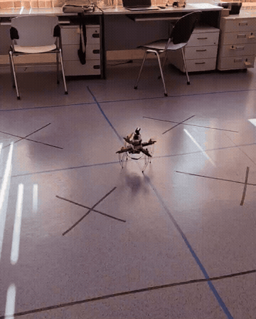

  

---

<h2 align="left">🚁 Обо мне</h2>

Занимаюсь **робототехникой** — проектирую и программирую **мультикоптеры**. Работаю с полётными контроллерами на базе **PX4**, строю ROS2-ноды для автономной навигации и компьютерного зрения. Хорошо знаю **Python**, активно осваиваю **C++**. Вхожу в тройку победителей симуляционного этапа АЭРОБОТ-2025 и победитель грантовой программы «Студенческий стартап» VII волны!

🎓 Бакалавр, направление "Программная инженерия"

🔭 Сейчас фокусируюсь на автономных полётных системах и интеграции БПЛА с ROS2

---

<h2 align="left">🛠 Технологический стек</h2>

<h4>Робототехника и БПЛА</h4>

<h4>Языки и фреймворки</h4>

<h4>Инструменты</h4>

---

<h2 align="left">📫 Связь</h2>

---

<h2 align="left">📊 Статистика</h2>

---

<h2 align="left">📈 Активность</h2>

---

